# Kun AI - Voice AI Platform

**Kun AI** is a full-stack AI-powered voice generation platform designed for real-time, character-based speech synthesis.  
Built using **FastAPI (backend)** and **React (frontend)**, it demonstrates modern AI integration, scalable architecture, and real-world system design.

---

## Demo
[🔗 Demo Video Link]

---

## Screenshots

### Authentication
| Login Page |
|------------|
| 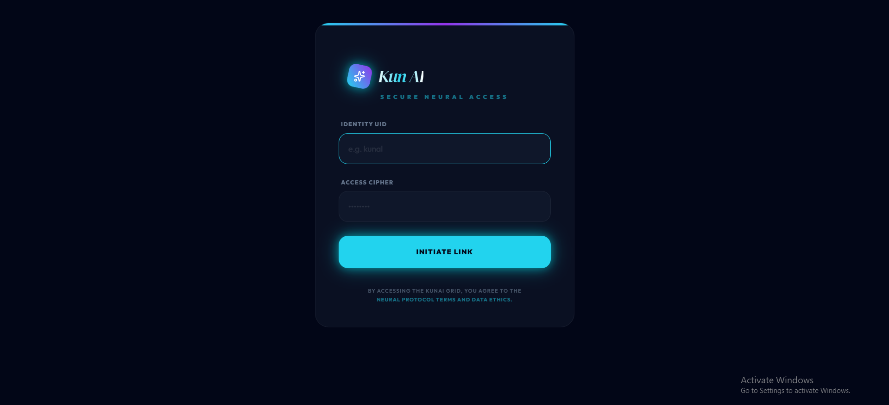 |

---

### Home & Discovery
| Home (Recent & Trending) | Discovery (Search Characters) |
|-------------------------|------------------------------|
| 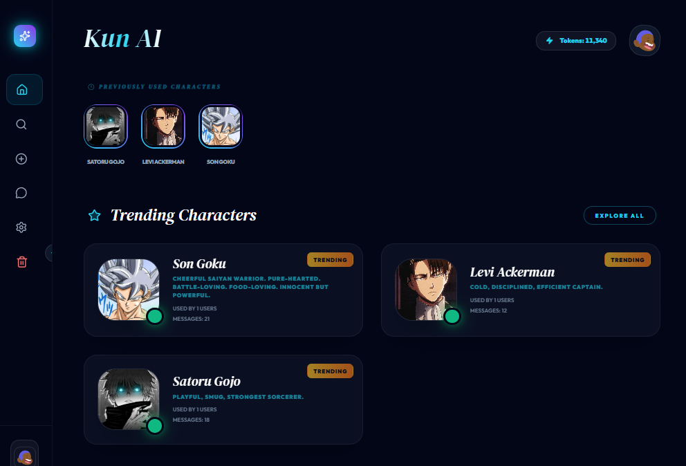 | 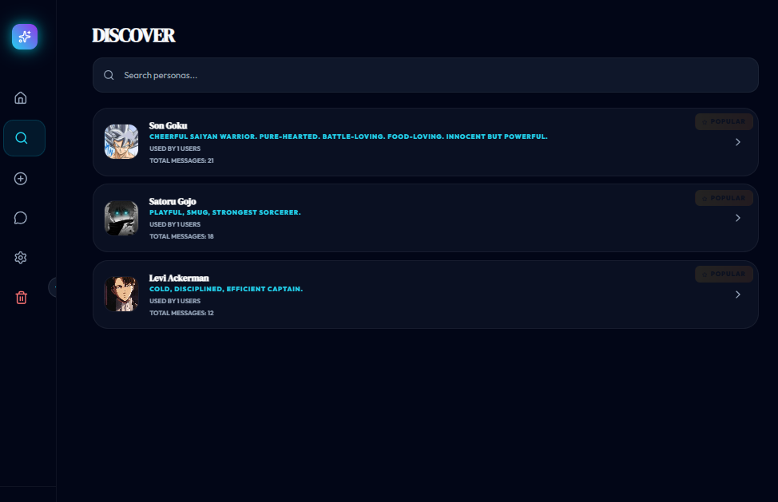 |

---

### Chat Experience
| English Chat | Hinglish Chat + Voice Playback |
|--------------|-------------------------------|
| 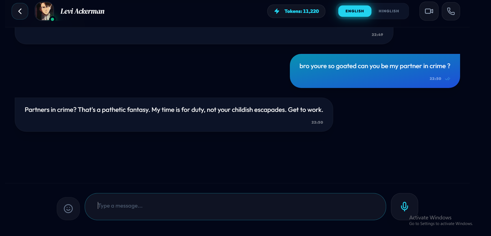 | 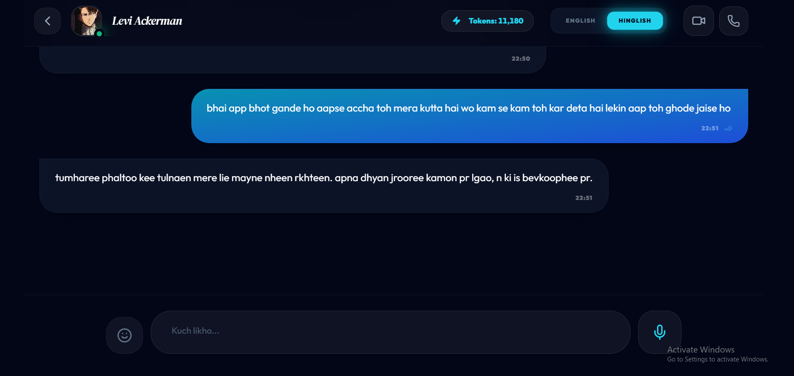 |

**Highlights:**
- Chat in English or Hinglish  
- Voice playback support  
- Call feature (video call in progress)

---

### Character Creation
| Create Your Character |
|----------------------|
| 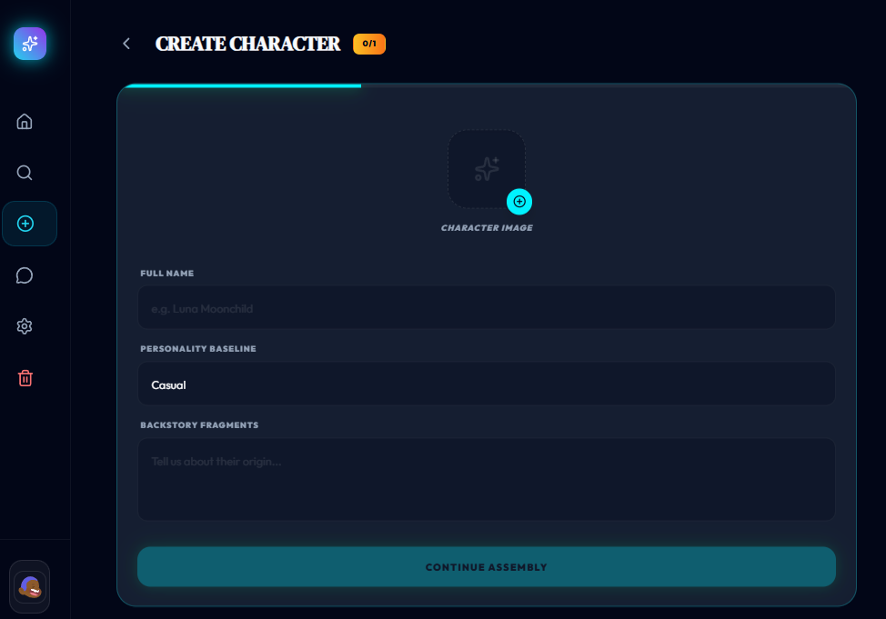 |

---

### Messages
| Message History |
|----------------|
| 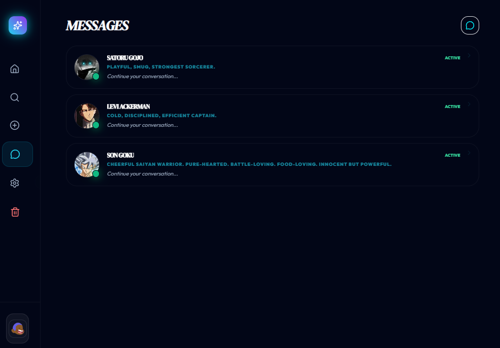 |

---

### Settings & Profile
| Profile |
|--------|
| 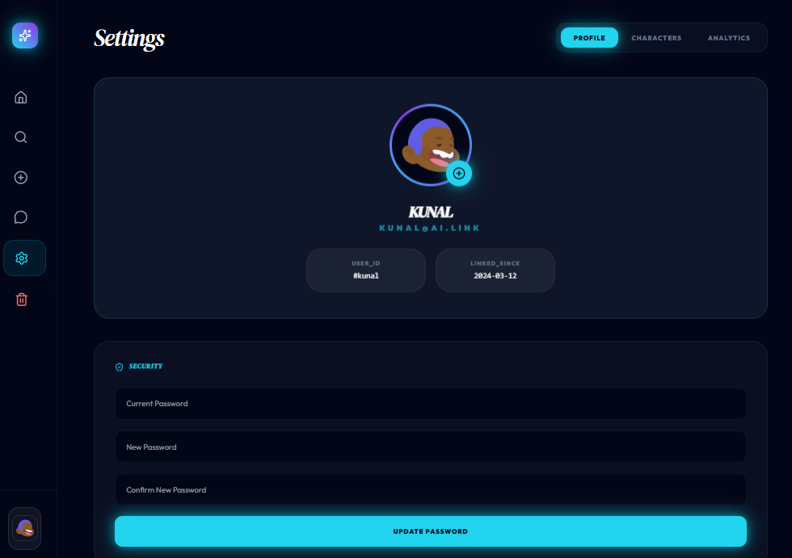 |

---

### Character Management
| Manage Characters |
|------------------|
| 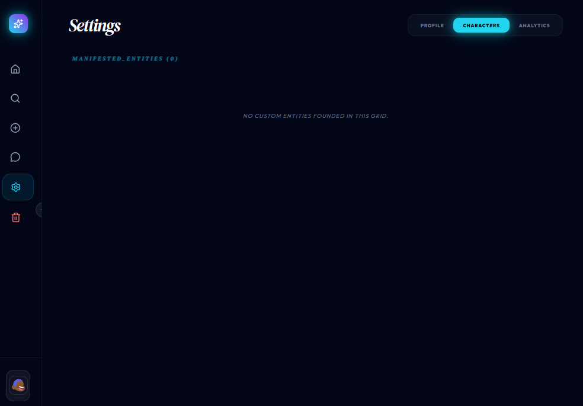 |

---

### Analytics
| Usage Analytics |
|----------------|
| 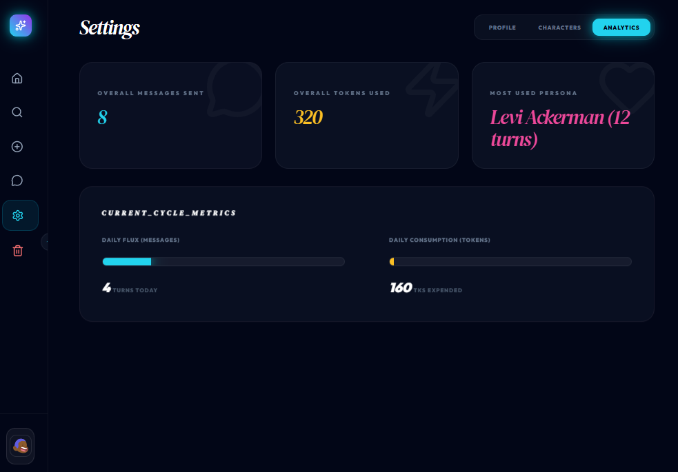 |

---

### Complete Platform View
| Full Application Overview |
|--------------------------|
| 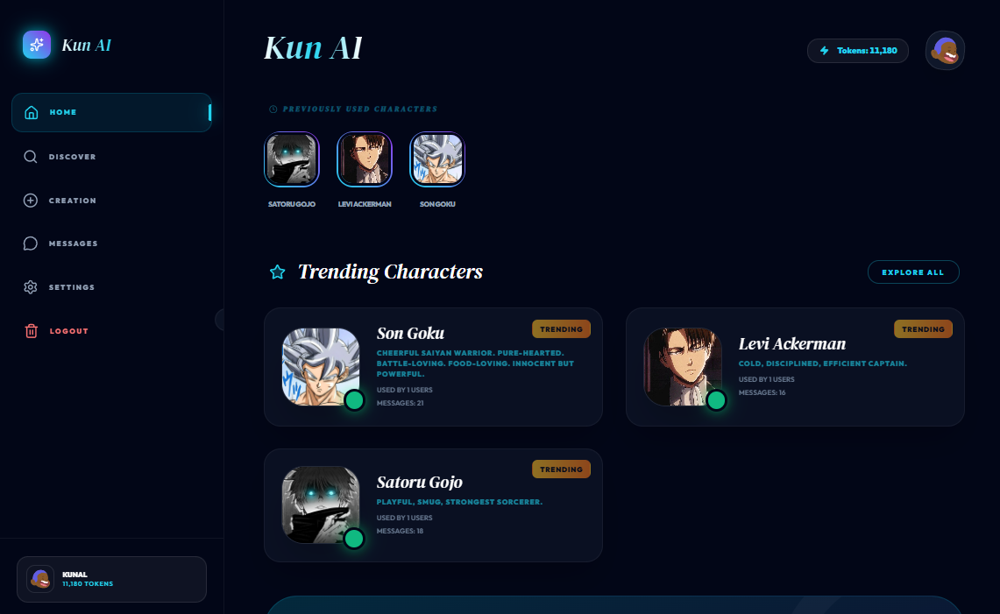 |

---

##  Features

-  **AI Voice Generation** — Real-time text-to-speech synthesis  
-  **Character-Based Voices** — Unique AI personalities  
-  **Multilingual Support** — English + Hinglish optimized  
-  **Interactive UI** — Smooth and modern frontend experience  
-  **AI Integration** — LLM + STT + TTS pipeline design  
-  **Scalable Architecture** — Modular full-stack structure  

---

##  Tech Stack

**Frontend**
- React (Vite)
- Tailwind CSS
- Framer Motion
- Lucide Icons

**Backend**
- FastAPI
- Uvicorn
- Python-dotenv

**AI & Audio**
- TTS: Edge-TTS, Coqui XTTS (local)
- STT: Whisper (Faster-Whisper)
- LLM: Google Gemini API

**Auth & Security**
- JWT Authentication
- BCrypt Hashing

**Database**
- JSON-based lightweight storage

---

##  Important Notes

-  **Deployment Status**  
  This project is currently **not deployed publicly**.  
  It is developed and tested in a local environment.

-  **Private Source Code**  
  The complete production-ready codebase is maintained in a **private repository**  
  to prevent API key exposure and protect sensitive integrations.

-  **Startup Vision**  
  This project is being developed as a **startup-level product**,  
  and a full production deployment is planned in the future.

---

##  Project Highlights

-  Full-stack AI system (Frontend + Backend + AI integration)  
-  Real-time voice processing pipeline (STT → LLM → TTS)  
-  Performance-optimized architecture  
-  Built with scalability and product vision in mind  

---

##  Contact / Access Request

If you’d like to explore the full implementation or discuss this project:

📩 Connect with me: [https://www.linkedin.com/in/kunal-na-40a878391/]

---
